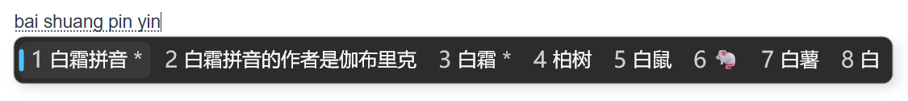
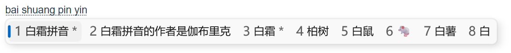

# rime 自用配置

基于[白霜拼音](https://github.com/gaboolic/rime-frost)修改而来。  
自用备份，仅供参考。

主要修改：
* 将/模式符号输入重新改回[雾凇拼音](https://github.com/iDvel/rime-ice)的v模式
* 半角模式部分符号修改，详见[default.custom.yaml](./default.custom.yaml)
    * ^直接上屏，……挪到\_的选单中
    * \_的选单中加入_、·、・
    * /直接上屏
    * $的选单中加入¥、 '$'、 '€'、 '£'、  '¢'、 '¤' 、 ￥
    * <>、[]、{} 不直接上屏，可选多种括号
* CapsLock键切换中英文
* 美化
    * 中英文状态提示图标改用[薄荷拼音](https://github.com/Mintimate/oh-my-rime)的图标
    * 小狼毫Weasel专用：
        * 中英文状态提示图标展示事件缩短至500ms
        * 全局中英文切换
        * Windows 11风格主题（参考了[小狼毫wiki](https://github.com/rime/weasel/wiki/%E7%A4%BA%E4%BE%8B#windows-11-%E9%A3%8E%E6%A0%BC)，并进行了优化调整）
            * 缩小了候选字字号，调整baseline使含emoji和纯文字候选框高度一致
            * 缩小边距
            * 半透明边框，更贴近原版外观
            * 反映出原版候选字编号颜色与候选字不同的特征（对比度略低突出候选字）
            
深色模式预览：  

浅色模式预览：  

